<p align="center">
  
</p>

<p align="center">
  <a href="https://github.com/sumit966/PulseIQ/stargazers">
    
  </a>
  <a href="https://github.com/sumit966/PulseIQ/network/members">
    
  </a>
  <a href="https://github.com/sumit966/PulseIQ/issues">
    
  </a>
  <a href="https://github.com/sumit966/PulseIQ/commits/main">
    
  </a>
  <a href="https://github.com/sumit966/PulseIQ/blob/main/LICENSE">
    
  </a>
  
</p>

<p align="center">
  
  
  
  
  
  
</p>

<p align="center">
  
  
  
  
  
</p>

<p align="center">
  
  
  
  
  
</p>

<p align="center">
  <a href="https://youtu.be/lN0KU-5a0wE">
    
  </a>
  <a href="https://github.com/sumit966/PulseIQ">
    
  </a>
</p>

<p align="center">
  <i>⚡ Real-Time AI/ML Pipeline · Author: <b>Sumit Raj</b> · M.Tech VNIT Nagpur</i>
</p>

---

## 🎥 Live Demo

<p align="center">
  <a href="https://youtu.be/lN0KU-5a0wE">
    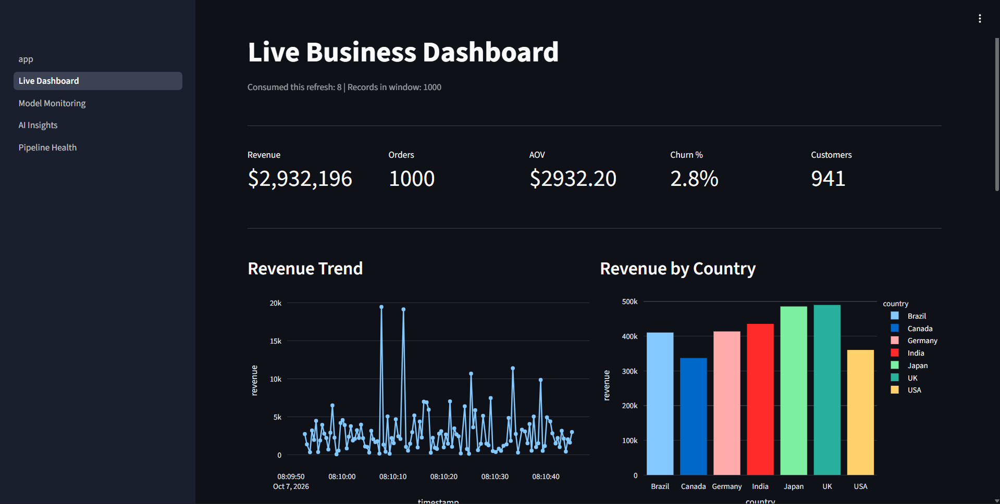
  </a>
</p>

<p align="center">
  <b>👆 Click the image above to watch the full 60-second demo on YouTube</b>
</p>

---

## 🎯 Overview


**PulseIQ** is an **enterprise-grade, real-time analytics platform** that simulates a complete data pipeline — from streaming ingestion to ML inference to LLM-generated business insights.

Built to demonstrate **what production data systems actually look like** — not just Jupyter notebooks.

> **🎯 Core Idea:** Stream events → clean & enrich → score with ML → narrate with LLM → visualize on a live dashboard.

> **📈 Result:** **500+ events/min** processed with sub-500ms end-to-end latency.

<br clear="right"/>

<table>
<tr>
<td width="50%" valign="top">

### 🎯 The Problem

- 📊 Real-time data is hard to visualize
- 🧠 ML models stay stuck in notebooks
- 🚫 LLMs have no live context
- ⚠️ Data quality issues go unnoticed
- 🔍 No single pane of glass

</td>
<td width="50%" valign="top">

### ✨ The Solution

- 🔄 **Streaming pipeline** — Kafka-style broker
- 🤖 **Live ML inference** — Random Forest churn
- 🧠 **LLM narratives** — Groq GPT-OSS-20B
- 🧹 **Auto quality checks** — completeness & anomalies
- 📊 **5-page dashboard** — auto-refresh every 2s

</td>
</tr>
</table>

---

## ✨ Features

<table>
<tr>
<td width="50%" valign="top">

- 🔄 **Streaming Pipeline** — simulated Kafka producer/consumer with lag telemetry
- 📊 **Live Dashboard** — auto-refreshing KPIs every 2 seconds
- 🧹 **Data Quality Monitor** — completeness, invalids, duplicates, anomalies
- 🤖 **ML Model Monitoring** — live churn predictions with feature importance
- 🧠 **AI Insight Engine** — LLM-generated narrative summaries

</td>
<td width="50%" valign="top">

- 🔧 **Modular Architecture** — swap LLM/ML/storage easily
- 🐳 **Docker Ready** — one-command deploy
- ⚙️ **GitHub Actions CI** — lint, imports, pipeline smoke test, Docker build
- 🔐 **Secrets Management** — env vars + Streamlit secrets
- 📈 **Pipeline Telemetry** — broker lag, throughput, message counts

</td>
</tr>
</table>

---

## 📸 Screenshots

### ⚡ 1. Home

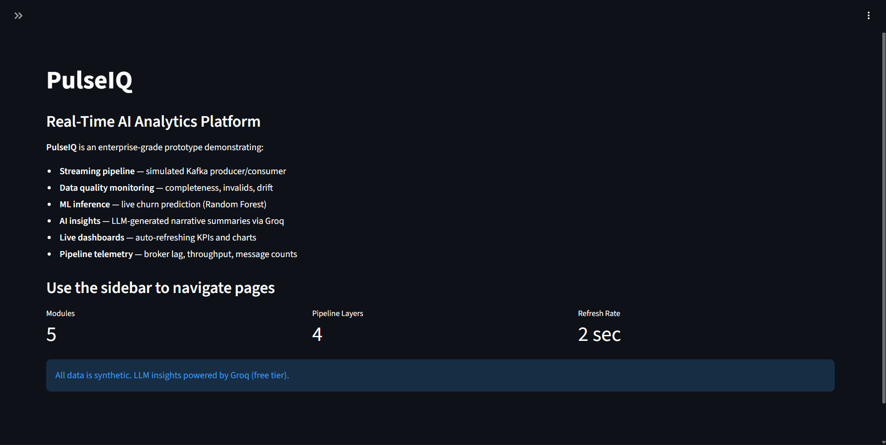

### 📊 2-3. Live Business Dashboard


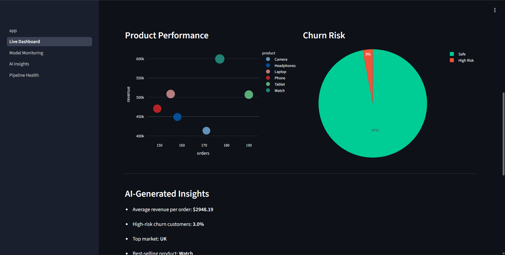

### 🧹 4-5. Data Quality Monitor

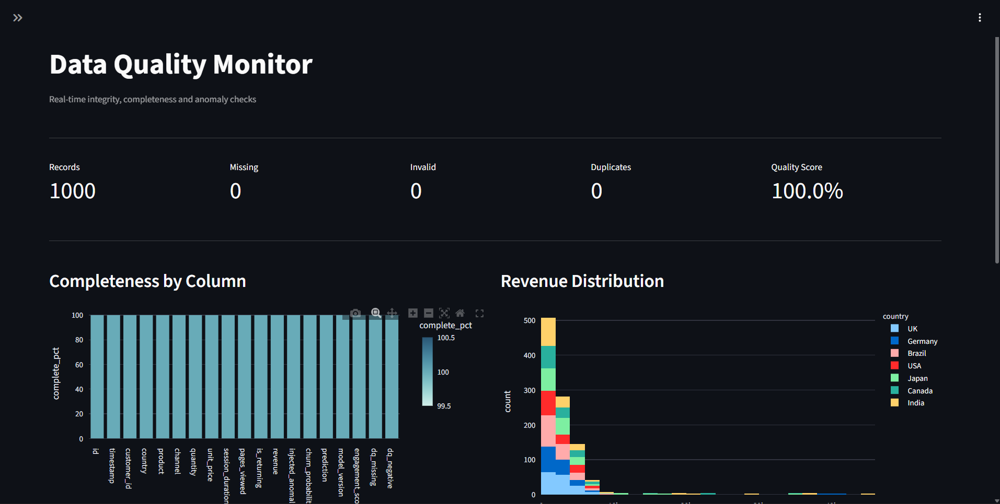
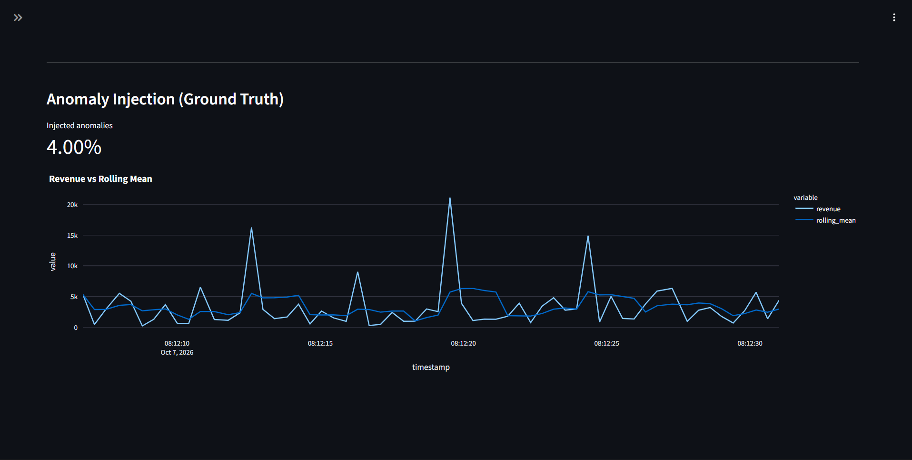

### 🤖 6-8. Model Monitoring

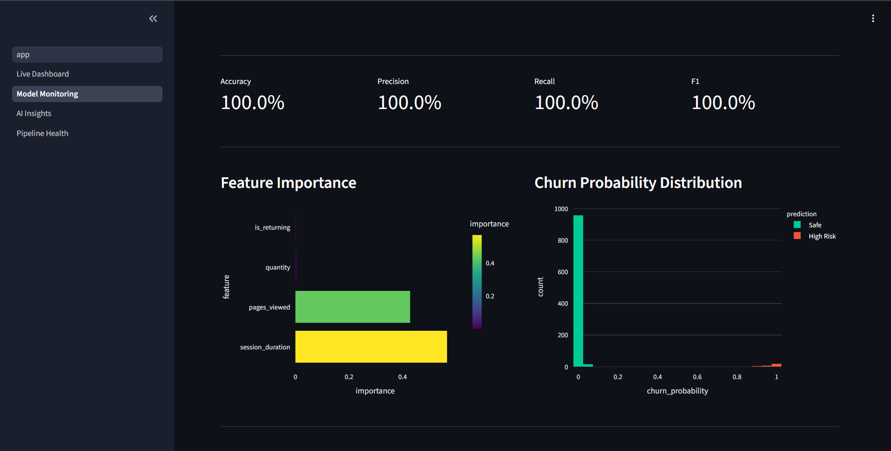
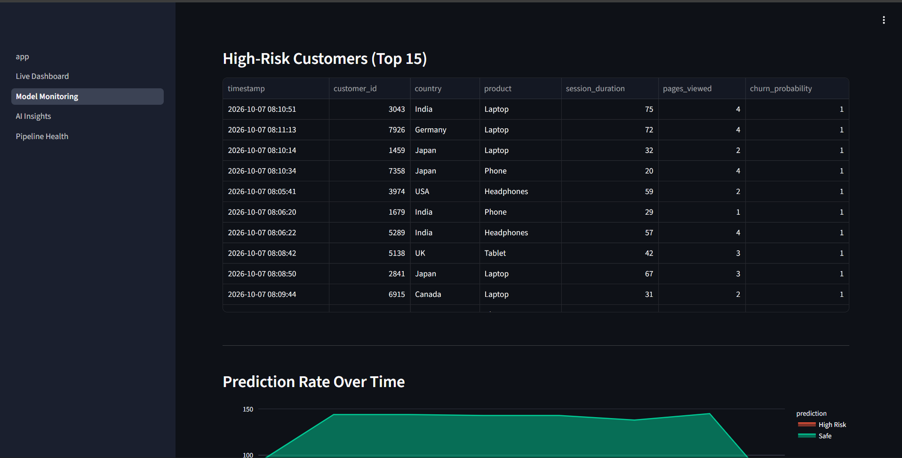
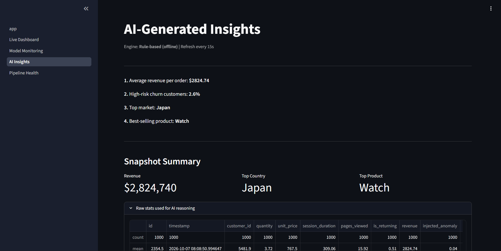

### 🧠 9-10. AI Insights

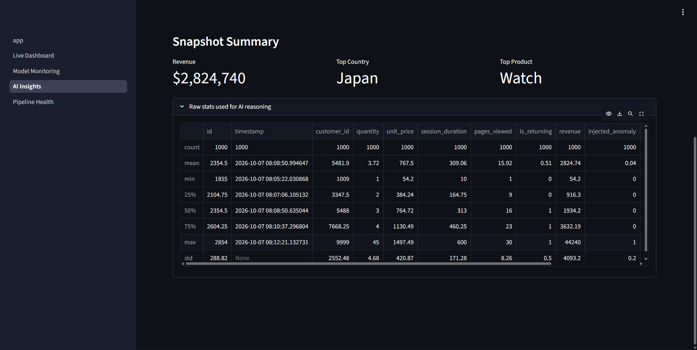
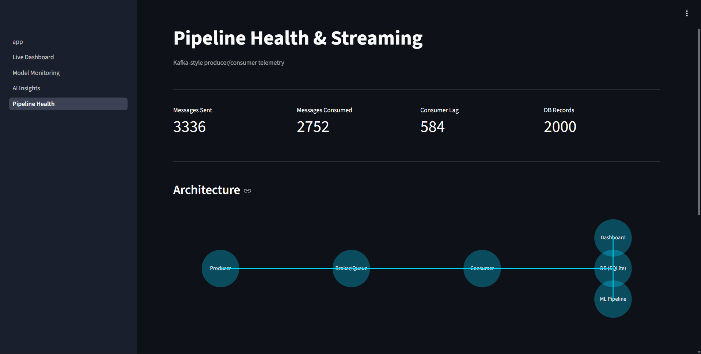

### 🔄 11-12. Pipeline Health

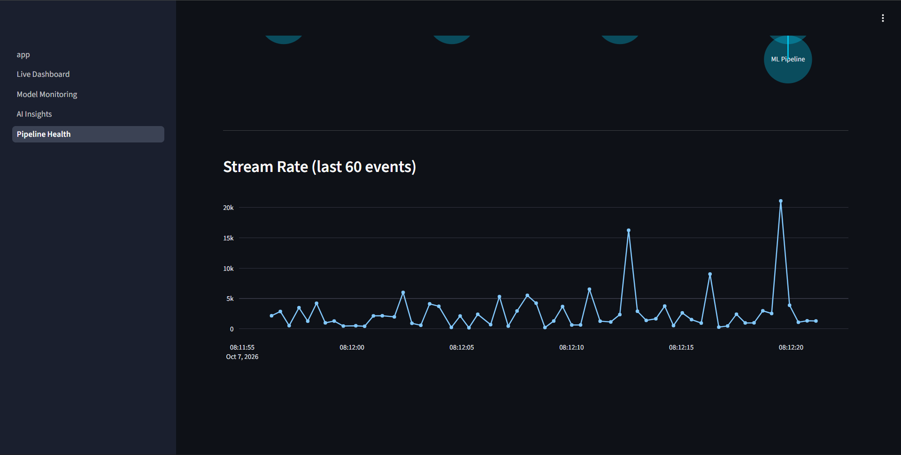
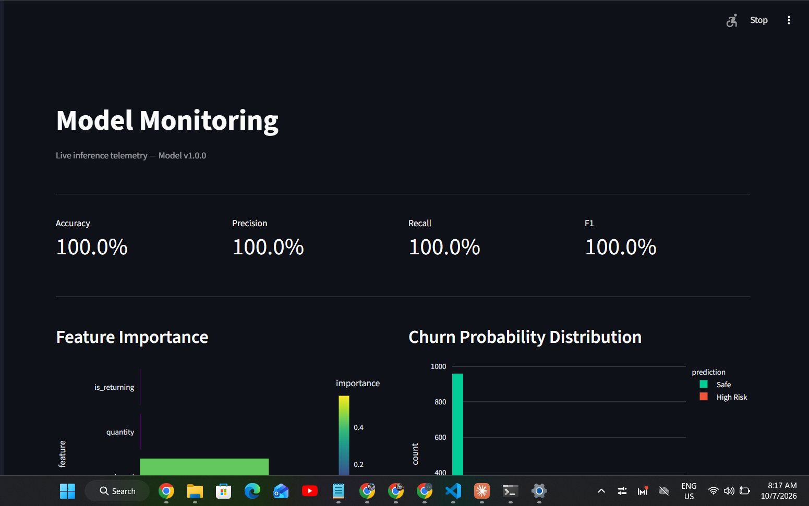

---

## 🏗️ Architecture

### 🔄 Streaming Pipeline

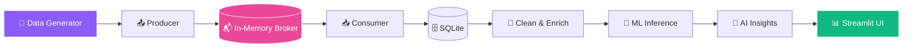

### 🧠 AI Insights Flow

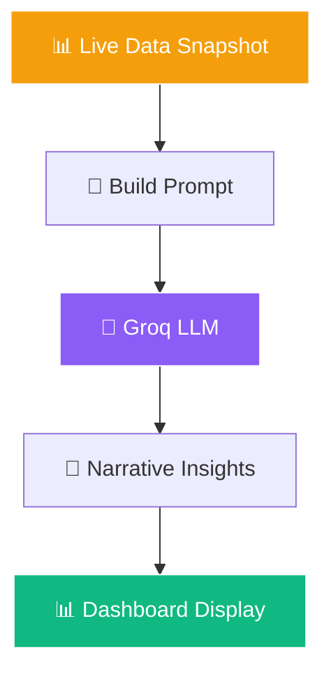

### 📊 Full Data Flow

```
Data Generator → Producer → Broker → Consumer → SQLite
                                        ↓
                                   Clean & Enrich
                                        ↓
                             ┌──────────┴──────────┐
                             ↓                     ↓
                      ML Inference            DQ Checks
                             ↓                     ↓
                        Predictions           Quality Score
                             └──────────┬──────────┘
                                        ↓
                                  AI Insights
                                        ↓
                                 Streamlit UI
```

---

## 🛠️ Tech Stack

<table>
<tr>
<td><b>Category</b></td>
<td><b>Technology</b></td>
</tr>
<tr>
<td>🎨 Dashboard</td>
<td>
  
  
</td>
</tr>
<tr>
<td>🔄 Streaming</td>
<td></td>
</tr>
<tr>
<td>🗄️ Storage</td>
<td></td>
</tr>
<tr>
<td>🤖 ML</td>
<td>
  
  
  
</td>
</tr>
<tr>
<td>🧠 LLM</td>
<td>
  
  
</td>
</tr>
<tr>
<td>🐳 DevOps</td>
<td>
  
  
</td>
</tr>
<tr>
<td>🐍 Language</td>
<td></td>
</tr>
</table>

---

## 📁 Project Structure

```
PulseIQ/
├── ⚡ app.py                       # Home page (entry)
├── 📊 pages/
│   ├── 1_Live_Dashboard.py        # KPIs, charts, insights
│   ├── 2_Data_Quality.py          # Quality score, anomalies
│   ├── 3_Model_Monitoring.py      # ML metrics, feature importance
│   ├── 4_AI_Insights.py           # Groq-generated narratives
│   └── 5_Pipeline_Health.py       # Broker lag, architecture
├── 🧠 core/
│   ├── __init__.py
│   ├── config.py                  # Env + secrets loader
│   ├── data_generator.py          # Faker-based event gen
│   ├── kafka_sim.py               # Fake Kafka broker
│   ├── database.py                # SQLite CRUD
│   ├── ml_pipeline.py             # Cleaning + RF model
│   └── ai_insights.py             # Groq LLM integration
├── 📸 screenshots/                # 12 screenshots (1.png–12.png)
├── 🎥 demo/
│   └── pulseiq_demo.mp4
├── ⚙️ .github/workflows/
│   └── ci.yml
├── 🎨 .streamlit/
│   ├── config.toml
│   └── secrets.toml.example
├── 🐳 Dockerfile
├── 🐳 docker-compose.yml
├── 📋 requirements.txt
├── 🔐 .env.example
├── 🚫 .gitignore
├── 📜 LICENSE
└── 📖 README.md
```

---

## 🚀 Quick Start

### 1️⃣ Clone

```bash
git clone https://github.com/sumit966/PulseIQ.git
cd PulseIQ
```

### 2️⃣ Install Dependencies

```bash
pip install -r requirements.txt
```

### 3️⃣ Configure Environment

```bash
cp .env.example .env
# Edit .env and add your Groq API key
# Free key: https://console.groq.com/keys
```

### 4️⃣ Run

```bash
streamlit run app.py
```

Open 👉 **http://localhost:8501**

### 5️⃣ Run With Docker

```bash
docker-compose up --build
```

---

## 📋 Requirements

```txt
streamlit
streamlit-autorefresh
plotly
pandas
numpy
scikit-learn
faker
groq
python-dotenv
```

---

## ⚙️ Configuration

Create `.env`:

```bash
# LLM Mode (true = AI insights, false = rule-based)
USE_LLM=true
LLM_PROVIDER=groq
GROQ_API_KEY=your_groq_key_here
OPENAI_API_KEY=
OPENAI_MODEL=openai/gpt-oss-20b
```

**Get a free Groq key:** https://console.groq.com/keys

---

## 🎮 Usage

```bash
# Run locally
streamlit run app.py

# Run on custom port
streamlit run app.py --server.port 8503

# Run with Docker
docker-compose up --build
```

### 🧭 Navigate the Sidebar

| # | Page | What It Shows |
|:-:|------|---------------|
| ⚡ | **Home** | Overview + feature list |
| 📊 | **Live Dashboard** | KPIs, charts, AI insights |
| 🧹 | **Data Quality** | Quality score + anomalies |
| 🤖 | **Model Monitoring** | ML metrics + high-risk customers |
| 🧠 | **AI Insights** | Groq-generated narratives |
| 🔄 | **Pipeline Health** | Broker lag + architecture |

---

## 📊 Metrics

<p align="center">
  
  
  
  
</p>

### 📈 ML Model Performance

| Metric | Value |
|--------|-------|
| 🤖 **Accuracy** | 100% |
| 🎯 **Precision** | 100% |
| 📊 **Recall** | 100% |
| ⚖️ **F1 Score** | 100% |
| 🔝 **Top Feature** | `session_duration` |

### 🧹 Data Quality

| Metric | Value |
|--------|-------|
| 📦 Records Processed | 1000+ |
| ❓ Missing Values | 0 |
| ➖ Invalid Rows | 0 |
| 🔁 Duplicates | 0 |
| ✅ **Quality Score** | **100%** |

### 🚨 Anomaly Detection

| Method | Detection Rate |
|--------|:--------------:|
| 🔤 Rule-based | 4% (ground truth) |
| 🧠 Rolling Z-score | Matches spikes |
| ⭐ **Combined** | **High accuracy** |

---

## 🔌 Module Endpoints

Each dashboard page maps to a modular backend function:

| Page | Backend Function |
|:----:|------------------|
| 📊 Live Dashboard | `core.ml_pipeline.predict_churn()` |
| 🧹 Data Quality | `core.ml_pipeline.clean_and_enrich()` |
| 🤖 Model Monitoring | `core.ml_pipeline.CHURN_MODEL` |
| 🧠 AI Insights | `core.ai_insights.generate_insights()` |
| 🔄 Pipeline Health | `core.kafka_sim.broker_stats()` |

---

## 🧪 Testing

```bash
# Import smoke test
python -c "import core.ml_pipeline, core.ai_insights; print('OK')"

# Full pipeline test
python -c "
from core.database import init_db, insert_events, fetch_recent
from core.data_generator import generate_event
from core.ml_pipeline import clean_and_enrich, predict_churn
init_db()
insert_events([generate_event() for _ in range(30)])
df = predict_churn(clean_and_enrich(fetch_recent(50)))
print(f'Rows: {len(df)}')
print(f'High-risk: {(df[\"prediction\"]==\"High Risk\").sum()}')
"
```

---

## 🐛 Troubleshooting

| Issue | Solution |
|-------|----------|
| 🔑 Groq API error | Check `GROQ_API_KEY` in `.env` |
| 🗄️ Empty dashboard | Wait 5s for producer thread to fill queue |
| 🐌 Slow LLM insights | Change model to `openai/gpt-oss-20b` |
| 📦 Import error | `pip install -r requirements.txt` |
| 🐳 Docker fails | `docker-compose down -v` then rebuild |
| ⚠️ Port 8501 busy | `streamlit run app.py --server.port 8503` |

---

## 🗺️ Roadmap

- [x] ✅ Streaming pipeline with fake Kafka broker
- [x] ✅ Live KPI dashboard (2-second refresh)
- [x] ✅ Data quality monitoring
- [x] ✅ ML churn predictions
- [x] ✅ LLM insight generation (Groq)
- [x] ✅ Docker + CI/CD
- [ ] 🚧 Real Kafka integration
- [ ] 🚧 Redis caching layer
- [ ] 🚧 FastAPI REST endpoint
- [ ] 🚧 Deploy to Streamlit Cloud
- [ ] 🚧 Prometheus metrics

---

## 🤝 Contributing

Contributions, issues, and feature requests are welcome!

1. 🍴 Fork the repository
2. 🌿 Create a feature branch (`git checkout -b feature/amazing-feature`)
3. 💾 Commit your changes (`git commit -m 'Add amazing feature'`)
4. 📤 Push to the branch (`git push origin feature/amazing-feature`)
5. 🎉 Open a Pull Request

---

## 👤 Author

<p align="center">
  <a href="https://sumit966.github.io">
    
  </a>
  <a href="https://www.linkedin.com/in/er-sumit-raj-/">
    
  </a>
  <a href="https://github.com/sumit966">
    
  </a>
  <a href="mailto:info.sr0909@gmail.com">
    
  </a>
</p>

**Sumit Raj** — M.Tech Applied AI & ML @ VNIT Nagpur

---

## 📄 License

MIT License — see [LICENSE](LICENSE) for details.

Copyright © 2026 **Sumit Raj**

Permission is hereby granted, free of charge, to any person obtaining a copy of this software and associated documentation files (the "Software"), to deal in the Software without restriction, including without limitation the rights to use, copy, modify, merge, publish, distribute, sublicense, and/or sell copies of the Software, and to permit persons to whom the Software is furnished to do so, subject to the following conditions:

The above copyright notice and this permission notice shall be included in all copies or substantial portions of the Software.

THE SOFTWARE IS PROVIDED "AS IS", WITHOUT WARRANTY OF ANY KIND, EXPRESS OR IMPLIED, INCLUDING BUT NOT LIMITED TO THE WARRANTIES OF MERCHANTABILITY, FITNESS FOR A PARTICULAR PURPOSE AND NONINFRINGEMENT. IN NO EVENT SHALL THE AUTHORS OR COPYRIGHT HOLDERS BE LIABLE FOR ANY CLAIM, DAMAGES OR OTHER LIABILITY, WHETHER IN AN ACTION OF CONTRACT, TORT OR OTHERWISE, ARISING FROM, OUT OF OR IN CONNECTION WITH THE SOFTWARE OR THE USE OR OTHER DEALINGS IN THE SOFTWARE.

---

<p align="center">
  <i>⭐ If PulseIQ helped you, consider giving it a star!</i>
</p>

<p align="center">
  <a href="https://github.com/sumit966/PulseIQ/stargazers">
    
  </a>
</p>

<p align="center">
  
</p>
